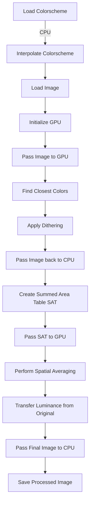

# Image Colorizer

**Never settle for images outside your colorscheme again!**
Now 🔥B l a z i n g F a s t🔥 thanks to 🦀Rust and 🖥️WGSL

## Install


### AUR

```bash
paru -Syu image-colorizer # Or whatever AUR helper you use. yay, pikaur, etc
```

### Cargo

```bash
cargo install image-colorizer
```

I am currently working on adding support for other package managers, such as the brew, deb, etc.

## Quick Start

### Single Image
```bash
image-colorizer input_image1.jpg # Outputs input_image1_{colorscheme}.jgp
```

### Multiple Images

```bash
image-colorizer -o ./processed_images input_image1.jpg input_image2.png
```

## Features

- 🔥 GPU-accelerated image processing using WebGPU Shading Language (WGSL)
- 🎨 Support for custom color schemes
- 🥷 Minimal artifacting through advanced color blending techniques
- 🤹 Parallel processing of multiple images

## Prerequisites

Before you begin, ensure you have a GPU that supports WebGPU

## Usage

To use the Image Colorizer, run the following command:

```bash
image-colorizer [OPTIONS] <IMAGE_PATHS>...
```

### Options

- `-b, --blend-factor <FACTOR>`: Set the blend factor (0.0-1.0)
- `--interpolation-threshold <THRESHOLD>`: Set the interpolation threshold (0.0-100.0)
- `-d, --dither-amount <AMOUNT>`: Set the dither amount (0.0-1.0)
- `--spatial-averaging-radius <RADIUS>`: Set the spatial averaging radius (0-100)
- `-c, --config <CONFIG_FILE>`: Specify a custom config file
- `-o, --output <OUTPUT_DIR>`: Set the output directory
- `-h, --help`: Print help information

## Configuration

You can customize the colorizer's behavior by creating a configuration file. The default location for the config file is `~/.config/colorizer/config.toml`. Here's an example configuration:

```toml
blend_factor = "0.9"
colorscheme = "kanagawa"
interpolation_threshold = "2.5"
dither_amount = "0.1"
spatial_averaging_radius = "10"
```

You can also create custom color schemes by adding a TOML file with the color values in the `~/.config/colorizer/` directory.

## How It Works

he Image Colorizer uses a sophisticated combination of CPU and GPU processing to efficiently transform images. Here's a detailed overview of the process:



1. The colorscheme is loaded and interpolated on the CPU to fill gaps in color space.
2. The input image is loaded via CPU.
3. The GPU is initialized with WebGPU.
4. The image data is transferred to the GPU.
5. For each pixel, the closest color from the interpolated color scheme is found.
6. Dithering is applied to reduce color banding.
7. The processed image is passed back to the CPU.
8. A Summed Area Table (SAT) is created for efficient spatial averaging.
9. The SAT is passed back to the GPU.
10. Spatial averaging is performed using the SAT.
11. Luminance is transferred from the original image to preserve detail.
12. The final processed image is transferred back to the CPU.
13. The resulting image is saved to disk.

## Contributing

Contributions are welcome! Please feel free to submit a Pull Request.

## License

This project is licensed under the MIT License - see the [LICENSE.md](LICENSE.md) file for details.
