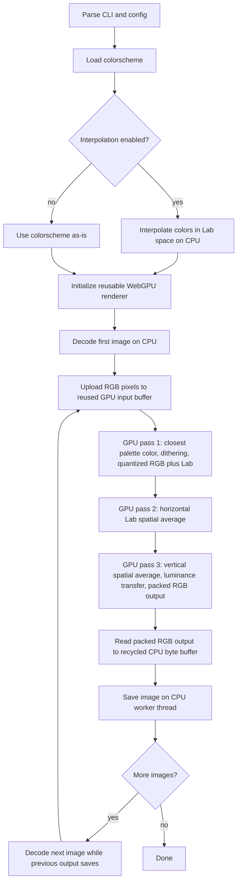

# Image Colorizer

**Make any wallpaper match your colorscheme.**

Image Colorizer is a Rust/WebGPU tool that recolors wallpapers and images to fit palettes like Kanagawa, Catppuccin, Nord, Gruvbox, Tokyo Night, or your own custom colorscheme.

Use it as a CLI for batch-processing wallpaper folders, or try the static browser demo that runs locally in your browser.

[](https://imagecolorizerapp.netlify.app/)
[](https://aur.archlinux.org/packages/image-colorizer)
[](https://crates.io/crates/image-colorizer)
[](https://github.com/TaylorBeeston/image-colorizer/releases)


## Gallery

| Original | Kanagawa | Catppuccin Mocha | Nord | Gruvbox |
|---|---|---|---|---|
|  |  |  |  |  |

## Why?

Tools like pywal and wallust generate a theme from a wallpaper. Image Colorizer solves the inverse problem: you already have a theme, and you want your wallpapers to match it.

| Tool | What it does |
|---|---|
| pywal / wallust | Generate a theme from a wallpaper |
| Image Colorizer | Generate a wallpaper from a theme |

## Install

### AUR

```bash
paru -Syu image-colorizer # Or whatever AUR helper you use. yay, pikaur, etc
```

### Cargo

```bash
cargo install image-colorizer
```

### Library

```toml
[dependencies]
image-colorizer-core = "1"
image = "0.24"
anyhow = "1"
palette = "0.7"
```

```rust
use image_colorizer_core::{ColorizerConfig, GpuColorizer};
use palette::Lab;

async fn colorize_file() -> anyhow::Result<()> {
    let config = ColorizerConfig {
        blend_factor: 0.9,
        colors: vec![Lab::new(50.0, 0.0, 0.0)],
        dither_amount: 0.1,
        spatial_averaging_radius: 10,
    };

    let image = image::open("input.png")?;
    let mut colorizer = GpuColorizer::new(&config).await?;
    let output = colorizer.colorize(&image).await?;

    image::save_buffer(
        "output.png",
        &output.data,
        output.width,
        output.height,
        image::ColorType::Rgb8,
    )?;
    Ok(())
}
```

Additional package-manager support may be added later.

## Quick Start

### Single Image

```bash
image-colorizer input_image1.jpg # Outputs input_image1_{colorscheme}.jpg
```

### Multiple Images

```bash
image-colorizer -o ./processed_images input_image1.jpg input_image2.png
```

### Local Web UI

```bash
image-colorizer serve
```

Then open `http://127.0.0.1:8474`. The web UI runs locally and uses the same native GPU pipeline as the CLI. After uploading an image, slider and colorscheme edits re-render the preview automatically. The page can also save the current parameters to `config.toml` and write the edited colorscheme into the config directory.

## Features

- GPU-resident image processing using WebGPU Shading Language (WGSL)
- CLI batch processing for wallpaper folders
- Static browser app that runs locally with WebGPU and a WASM CPU fallback
- Custom local colorschemes, with missing built-in schemes downloaded automatically
- Colorscheme interpolation, dithering, and spatial averaging to reduce banding/artifacts
- Efficient batch processing with one reusable GPU renderer and overlapped image decode/save
- AUR and Cargo installs

## Built-in colorschemes

Kanagawa, Catppuccin Latte/Frappe/Macchiato/Mocha, Nord, Tomorrow Night, Gruvbox Dark Hard, Tokyo Night Dark, Dracula, Everforest Dark Hard, Rosé Pine, Solarized Dark, Monokai, OneDark, and grayscale.

## Prerequisites

Before you begin, ensure you have a GPU that supports WebGPU.

## Usage

To use the Image Colorizer, run the following command:

```bash
image-colorizer [OPTIONS] [IMAGE_PATHS]...
image-colorizer [OPTIONS] serve [--bind <ADDR>]
```

### Options

- `-b, --blend-factor <FACTOR>`: Set the blend factor, from `0.0` to `1.0` (default: `0.9`)
- `--interpolation-threshold <THRESHOLD>`: Set the colorscheme interpolation threshold, greater than `0.0` and up to `100.0` (default: `2.5`)
- `--no-interpolation`: Disable colorscheme interpolation
- `-d, --dither-amount <AMOUNT>`: Set the dithering amount, from `0.0` to `1.0` (default: `0.1`)
- `--spatial-averaging-radius <RADIUS>`: Set the spatial averaging radius, from `0` to `100` (default: `10`)
- `-s, --colorscheme <SCHEME>`: Set the colorscheme (default: `kanagawa`)
- `-c, --config <CONFIG_FILE>`: Specify a custom config file (default: `~/.config/image-colorizer/config.toml`)
- `-o, --output <OUTPUT_DIR>`: Set the output directory
- `-h, --help`: Print help information
- `-V, --version`: Print version information
- `serve`: Start the local upload/download web UI
- `--bind <ADDR>`: Set the `serve` bind address (default: `127.0.0.1:8474`)

## Configuration

You can customize the colorizer's behavior by creating a configuration file. The default location for the config file is `~/.config/image-colorizer/config.toml`. Here's an example configuration:

```toml
blend_factor = "0.9"
colorscheme = "kanagawa"
interpolate_colors = true
interpolation_threshold = "2.5"
dither_amount = "0.1"
spatial_averaging_radius = "10"
```

You can also create custom color schemes by adding a text file with one hex color per line in `~/.config/image-colorizer/`. Lines may include comments with `//`. For example, `~/.config/image-colorizer/grayscale.txt` can be selected with `--colorscheme grayscale`.

If a requested colorscheme is not found beside the config file, Image Colorizer attempts to download `<colorscheme>.txt` from this repository's `colorschemes/` directory into your config directory.

## Static Browser App

The static app in `crates/image-colorizer-web/static/` opens with an optimized WebP sample before/after, palette picker, clickable gallery cards, and install links so visitors can see the value before uploading anything. It decodes images in the browser, runs the same three WGSL compute passes on the user's GPU when available, and falls back to a slower local WASM CPU renderer otherwise. No image data is uploaded.

`netlify.toml` publishes the web package's `static/` directory and sets the cross-origin headers browsers expect for GPU-heavy frontend work.

```bash
python -m http.server 8080 --directory crates/image-colorizer-web/static
```

Then open `http://127.0.0.1:8080`.

If you change the CPU fallback Rust code, rebuild the committed WASM assets before deploying:

```bash
wasm-pack build crates/image-colorizer-web --target web --out-dir static/pkg --release
```

## How It Works

Image Colorizer is a Cargo workspace with a reusable `image-colorizer-core` library and an `image-colorizer` CLI wrapper. The CLI initializes one reusable WebGPU renderer per command. Image decoding and output saving happen on CPU worker threads, but the colorization pipeline itself stays on the GPU until the final packed RGB readback.


```mermaid
graph TD
    A["Parse CLI and config"] --> B["Load colorscheme"]
    B --> C{"Interpolation enabled?"}
    C -->|yes| D["Interpolate colors in Lab space on CPU"]
    C -->|no| E["Use colorscheme as-is"]
    D --> F["Initialize reusable WebGPU renderer"]
    E --> F
    F --> G["Decode first image on CPU"]
    G --> H["Upload RGB pixels to reused GPU input buffer"]
    H --> I["GPU pass 1: closest palette color, dithering, quantized RGB plus Lab"]
    I --> J["GPU pass 2: horizontal Lab spatial average"]
    J --> K["GPU pass 3: vertical spatial average, luminance transfer, packed RGB output"]
    K --> L["Read packed RGB output to recycled CPU byte buffer"]
    L --> M["Save image on CPU worker thread"]
    M --> N{"More images?"}
    N -->|yes| O["Decode next image while previous output saves"]
    O --> H
    N -->|no| P["Done"]
```

1. CLI options and config are merged.
2. The colorscheme is loaded locally or downloaded, then optionally interpolated in Lab color space.
3. A single WebGPU device, queue, shader set, pipeline set, palette buffer, and scratch-buffer set are reused across the batch.
4. Each input image is decoded on a CPU worker thread.
5. RGB pixels are uploaded into the reusable GPU input buffer.
6. The first GPU pass finds the closest colorscheme color, applies dithering, stores quantized RGB, and keeps Lab values needed by later passes.
7. The second GPU pass computes the horizontal half of the spatial average in Lab space.
8. The third GPU pass computes the vertical half of the spatial average, transfers averaged chroma onto the pixel luminance, blends with the original color, and packs RGB output.
9. Packed RGB is read back once into a recycled CPU byte buffer.
10. The output image is saved on a CPU worker thread while the next image is decoded/processed.

## Contributing

Contributions are welcome! Please feel free to submit a Pull Request.

## License

This project is licensed under the MIT License - see the [LICENSE.md](LICENSE.md) file for details.
